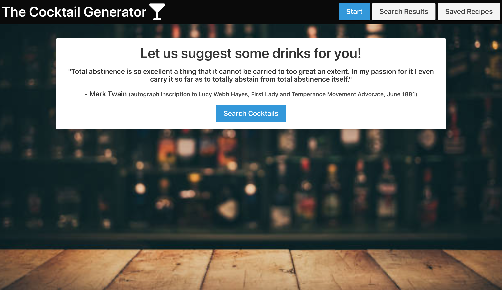
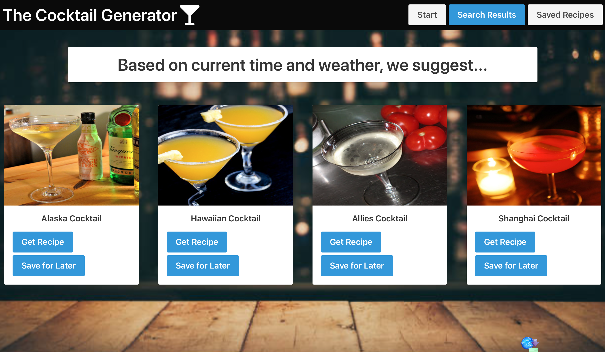
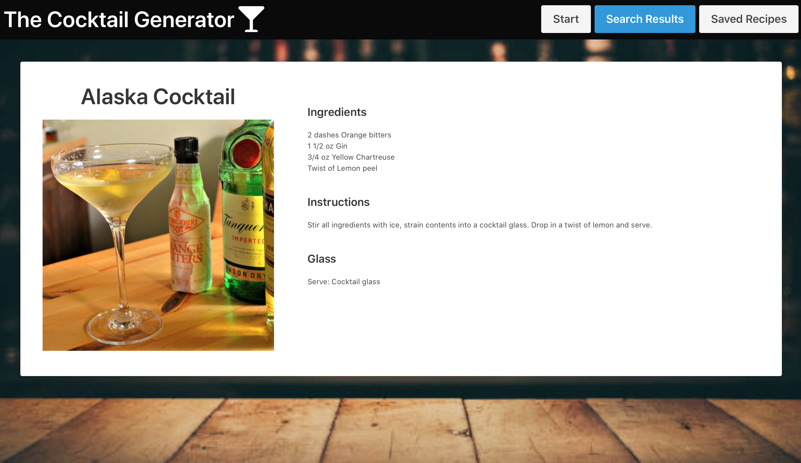

# cocktail-generator
## Table of Contents
- [cocktail-generator](#cocktail-generator)
  - [Table of Contents](#table-of-contents)
  - [Project Location](#project-location)
  - [Motivation](#motivation)
  - [Description and Usage](#description-and-usage)
  - [Installation](#installation)
  - [Future Direction](#future-direction)
  - [Credits](#credits)
  - [Resources](#resources)
  - [License](#license)

## Project Location

* [Deployed](https://github.com/Gavin867/cocktail-generator)
* [GitHub Repo](https://gavin867.github.io/cocktail-generator/)

## Motivation 
The craft cocktail renaissance had gained a massive amount of steam in the decade leading up to March of 2020 before COVID-19 devastated the Seattle bar and restaurant scene. With many of Seattle’s most prominent drinkeries put out of business, many of their former patrons are now stuck at home with the desire to drink cocktails and, in many cases, a lack of experience making them. Flipping through cocktail recipes can be fun, but there are times when the sheer number of options leads to a ‘Netflix Paradox of Choice’-type situation –you know, the one where the user wastes all the time they have to watch something looking for that right something to watch.

Ladies and gentleman, that is where The Cocktail Generator comes in!

## Description and Usage 
Cocktail Generator is a web application that recommends a list of cocktails that are appropriate to the users location & time zone. A couple of button clicks gets you four, well curated, cocktail suggestions with pictures and recipes! Four is a manageable amount of options last we checked, and if you want more, you can just keep running searches! 

This application was created with the following User Story and Acceptance Criteria in mind:
```
AS A person who wants to make an alcoholic beverage
I WANT to receive drink recipe recommendations which take into account time of day and the weather
SO THAT I can make a drink that’s right for the occasion 
```
```
GIVEN I want a logical cocktail recommendation
WHEN I press the “search cocktails” button
THEN I expect several cocktail suggestions based on temperature and time to appear
WHEN a cocktail item is shown
THEN I am presented with a picture of the cocktail, cocktail name, “show recipe” button, and “save” button 
WHEN I click on the “show recipe” button
THEN I am presented with instructions, required ingredients, and serving glass suggestions
```







## Installation
In order to install this project, the following technologies were used:
- Two server-side APIs, specifically OpenWeather and CocktailDB
- Moment.js
- Geolocation

Specifically, script.js executes 1) moment.js to capture the User's current time, 2) Geolocation to capture the User's coordinates, 3) OpenWeather to capture the User's current outside temperature, 4) several functions to filter and randomly select a specified number (4) of appropriate cocktails, and 5) CocktailDB to retreieve and display the image and drink name for the cocktail. 

updateRecipe.js and updateResults.js dynamically displays the appropriate cocktail recipe in the cocktail-results.html. 

## Future Direction
Some future add-ons that would enhance our application include:
- Saved recipes using client-side local storage
- Expanding the search button to take in user input such as spirit type, pagination (e.g., 5 or 20 results), location specification
- Development of better cocktail recipe API (e.g., better organization of data, more classification data, better recipes and pictures) 
- Resources Tab

## Credits
- Gavin Calkins (https://github.com/gavin867)
- Logan Zehr (https://github.com/zehrl)
- Andrena Juric (https://github.com/andrenajuric)
- Michael Bageant (https://github.com/bageantm)
- Ellie Fu-Hinthorn (https://github.com/elliefh)

## Resources
- OpenWeather (API): https://openweathermap.org/ 
- Moment.js (API): https://momentjs.com/ 
- TheCocktailDB (API): https://www.thecocktaildb.com/api.php 
- iStock (Background Image): https://www.istockphoto.com/ 

## License
Copyright (c) [2020] [Gavin Calkins, Logan Zehr, Andrena Juric, Michael Bageant, Ellie Fu-Hinthorn]

Permission is hereby granted, free of charge, to any person obtaining a copy of this software and associated documentation files (the "Software"), to deal in the Software without restriction, including without limitation the rights to use, copy, modify, merge, publish, distribute, sublicense, and/or sell copies of the Software, and to permit persons to whom the Software is furnished to do so, subject to the following conditions:

The above copyright notice and this permission notice shall be included in all copies or substantial portions of the Software.

THE SOFTWARE IS PROVIDED "AS IS", WITHOUT WARRANTY OF ANY KIND, EXPRESS OR IMPLIED, INCLUDING BUT NOT LIMITED TO THE WARRANTIES OF MERCHANTABILITY, FITNESS FOR A PARTICULAR PURPOSE AND NONINFRINGEMENT. IN NO EVENT SHALL THE AUTHORS OR COPYRIGHT HOLDERS BE LIABLE FOR ANY CLAIM, DAMAGES OR OTHER LIABILITY, WHETHER IN AN ACTION OF CONTRACT, TORT OR OTHERWISE, ARISING FROM, OUT OF OR IN CONNECTION WITH THE SOFTWARE OR THE USE OR OTHER DEALINGS IN THE SOFTWARE.
